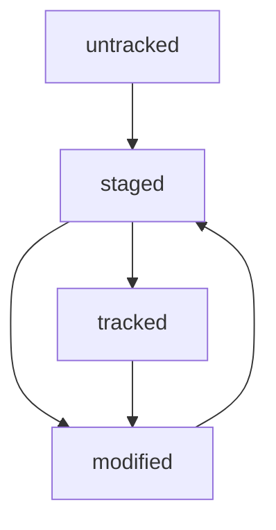

# Гид по Git для начинающих
---

## Навигация

* pwd - вывод пути папки, в которой сейчас находится пользователь
* ls - вывод файлов и папок в текущей директории
* ls -a - вывод файлов и папок, включая скрытые, в текущей директории
* cd [название директории] - перейти в папку
* cd .. - перейти на уровень выше
* cd ~ - перейти в домашнюю директорию
* cd / - перейти в корневую директорию

## Работа с файлами и папками
### Создание
* touch [Название файла] - создание файла в текущей директории
* touch [Название файла 1], [Название файла 2] - создание нескольких файлов в текущей директории
* mkdir [Название директории] - создание директории в текущей папке
### Копирование и перемещение 
* cp [Название файла] [Название директории] - копирование файла в указанную директорию
* mv [Название файла] [Название директории] - перемещение файла в указанную директорию
### Чтение
* cat [Название файла] - выводит в консоль содержимое файла
### Удаление
* rm [Название файла] - удаление файла
* rmdir [Название директории] - удаление папки
* rm -r [Название директории] - удаление папки и содержимого директории

### Хеш, лог и HEAD
Хеширование (от англ. hash, «рубить», «крошить», «мешанина») — это способ преобразовать набор данных и получить их «отпечаток» (англ. fingerprint)
* log - вывод коммитов с их описанием. Можно использовать вместе с флагом --oneline. Он отображает коммит в 72 символах
* HEAD - один из служебных файлов папки .git. Он указывает на коммит, который сделан последним

### Статусы файлов
* untracked (англ. «неотслеживаемый»)Новые файлы в Git-репозитории помечаются как untracked, то есть неотслеживаемые. Git «видит», что такой файл существует, но не следит за изменениями в нём. У untracked-файла нет предыдущих версий, зафиксированных в коммитах или через команду git add
* staged (англ. «подготовленный»)После выполнения команды git add файл попадает в staging area (от англ. stage — «сцена», «этап [процесса]» и area — «область»), то есть в список файлов, которые войдут в коммит. В этот момент файл находится в состоянии staged
* tracked (англ. «отслеживаемый»)Состояние tracked — это противоположность untracked. Оно довольно широкое по смыслу: в него попадают файлы, которые уже были зафиксированы с помощью git commit, а также файлы, которые были добавлены в staging area командой git add. То есть все файлы, в которых Git так или иначе отслеживает изменения.
* modified (англ. «изменённый») Состояние modified значит, что Git сравнил содержимое файла с последней сохранённой версией и нашёл отличия. Например, файл был закоммичен и после этого изменён.

### Исправляем коммит
* git commit --amend (от англ. amend - "исправить", "дополнить")
* git commit --amend --no-edit - дополнить коммит новыми файлами. Опция --amend создает новый коммит на основе старого. --no-edit сообщает о том, что сообщение коммита нужно оставить как было
* git commit --amend -m - поменять сообщение коммита

### Сменить редактор в Git
* git config --global core.editor "[название редактора]"

### Откатываем изменения 
* git restore --staged <file> - откатка file в untracked, если он был добавлен в staging area (с помощью git add)
* git reset --hard <commit hash> - откатка коммита (от англ. reset - "сброс", "обнуление")
* git restore <file> - отменить изменения в файле

### Просматриваем изменения и сопоставляем коммиты
* git diff - показывает изменения в файле. По умолчанию команда git diff не показывает изменения в staged-файлах — только в modified
* git diff <коммит1> <коммит2> - показывает как изменился файл из состояния коммит1 в состояние коммит2

### Редактируем файл через консоль
* echo "[Текст сообщения]" - выводит текст, который передали в качестве аргумента
* echo "[Текст сообщения]" >> fileName - в конец fileName записывается Текст сообщения
* echo "[Текст сообщения]" > fileName - в fileName записывается Текст сообщения. Исходный текст удаляется

## Работа с ветками

### Создаем ветку и перемещаемся по ней
* git branch - просмотр локальных веток
* git branch -a - просмотр всех веток (a - от англ. all)
* git branch [Название ветки] - создать ветку
* git checkout [Название ветки] - переключиться на другую ветку
* git checkout -b [Название ветки] - создать ветку и сразу же переключиться на неё. -b (от англ. branch)

### Сравниваем ветки

